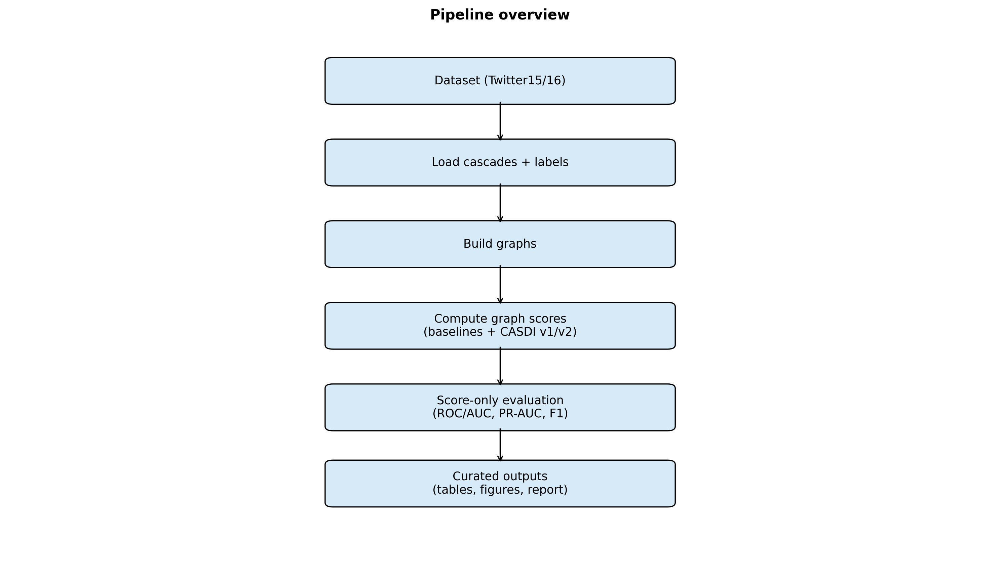
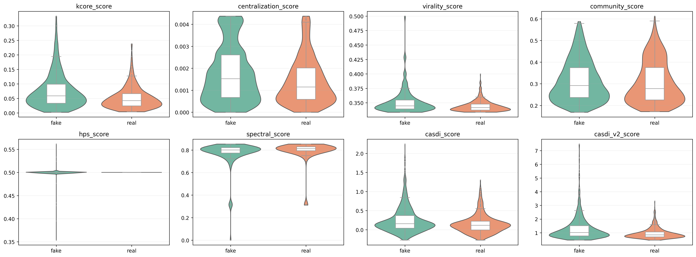
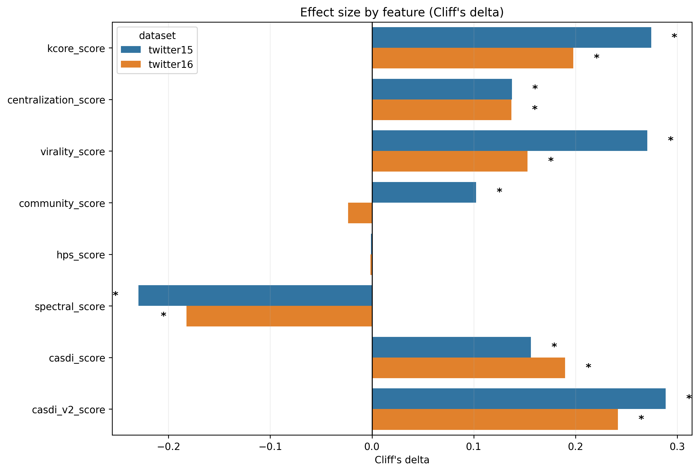
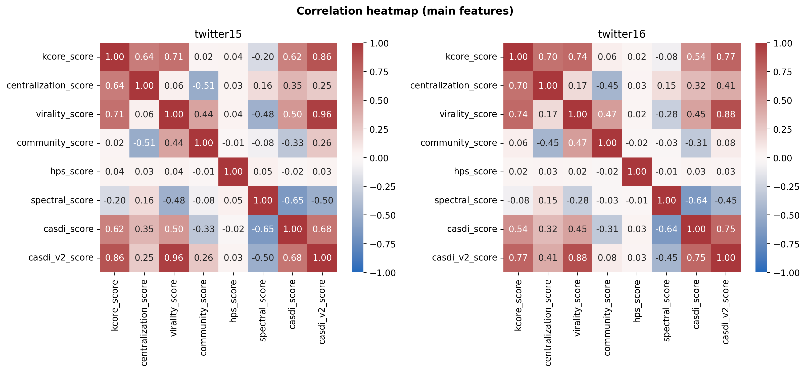
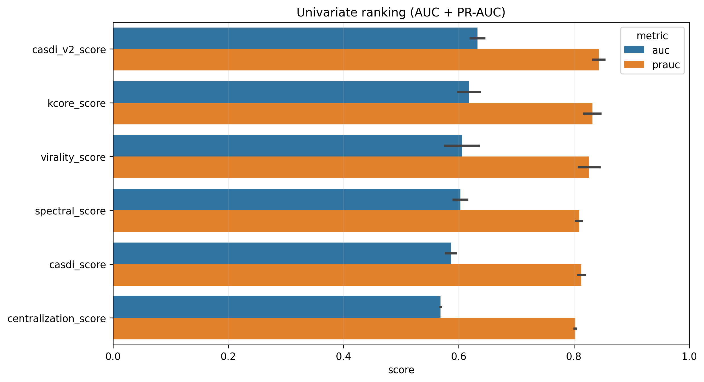
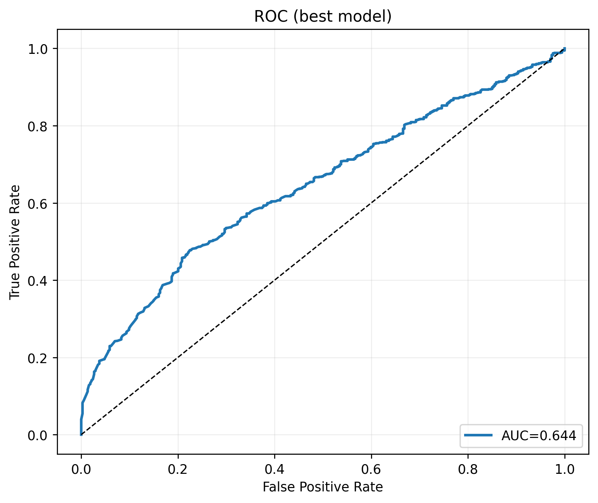
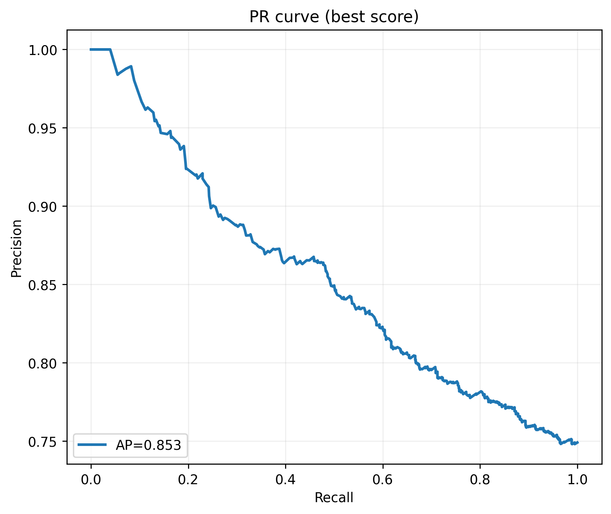
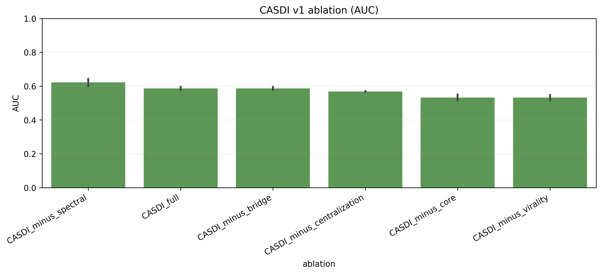
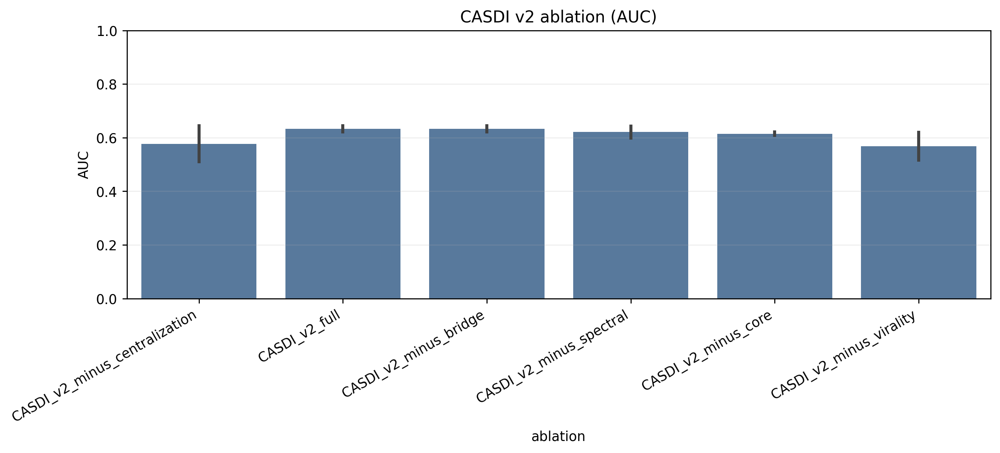

# Summary

## 1) Objectif
Détecter les fake news via des signaux de propagation (graph mining) sur Twitter15/16.

## 2) Méthode
Baselines: k-core, centralisation, virality, communities, HPS, spectral. Méthode développée: CASDI (v1) + CASDI_v2 (poids appris sur train).

## 3) Résultat principal (meilleur score)

- method: **casdi_v2_score**
- dataset: **twitter15**
- AUC: **0.6443** (CI [0.6149, 0.6744])
- F1: **0.8439** (CI [0.0000, 0.0000])

## 4) Conclusions

- Strongest separability features: casdi_v2_score (Δ=0.29, p=6.1e-17), kcore_score (Δ=0.27, p=1.9e-15), virality_score (Δ=0.27, p=4.5e-15).
- Cross-dataset generalization average F1=0.849 across directions.

## Figures

